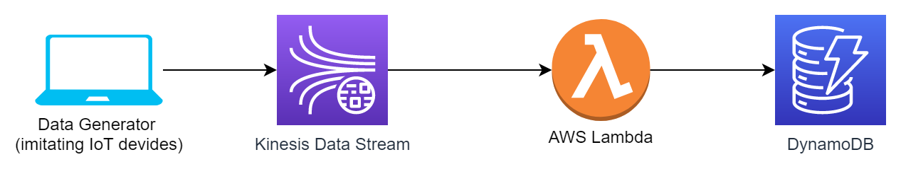

# Ongoing Project
## Table of contents
* [Purpose](#purpose)
* [Technologies](#technologies)
* [Setup](#setup)

## Purpose
This project builds a pipeline that uploads streaming data from Kinesis Data Stream to DynamoDB using AWS Lambda.

## Technologies
Project is created with:
* boto3 version: 1.20.44
	
## Setup
To run this project, install it locally using....

```
...
```